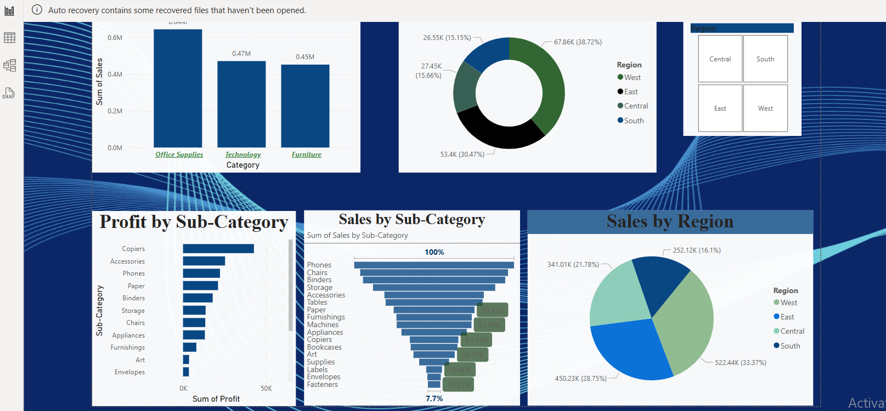

# 📊 Superstore Sales Dashboard - Power BI Project

This repository contains an interactive Power BI dashboard developed using the **Superstore dataset**. The dashboard provides insights into sales and profit performance across product categories, sub-categories, and regions.



---

## 📁 Dataset

- **Source File**: `_Superstore.xlsx`
- **Primary Table Used**: `Orders`
- **Key Fields**:
  - `Category`
  - `Sub-Category`
  - `Sales`
  - `Profit`
  - `Region`
  - `Order Date` *(optional for future improvements)*

---

## 🧩 Dashboard Visuals

| Visual                     | Description |
|---------------------------|-------------|
| **Sales by Category**      | Bar chart comparing total sales of Office Supplies, Technology, and Furniture. |
| **Profit by Sub-Category** | Horizontal bar chart showing profit distribution across sub-categories. |
| **Sales by Sub-Category**  | Horizontal bar chart with data labels and % contribution. |
| **Sales by Region**        | Pie and donut charts comparing regional sales (West, East, Central, South). |
| **Region Slicer**          | Interactive filter to view metrics by region. |

---

## ⚙️ Power BI File Structure

- **File Name**: `Superstore_Dashboard.pbix` *(not included — to be added)*
- **Pages**: 1 main dashboard page
- **Visual Types**: Bar chart, Pie chart, Donut chart, Slicers
- **Interactivity**: Region slicer filters all visuals

---

## 🧠 DAX Measures Used (Sample)

```dax
Total Sales = SUM(Orders[Sales])

Total Profit = SUM(Orders[Profit])

Sales % = 
DIVIDE(
    SUM(Orders[Sales]),
    CALCULATE(SUM(Orders[Sales]), ALL(Orders[Sub-Category]))
)
```

---

## 🚀 Getting Started

To view or customize this dashboard:

1. Clone this repository:
   ```bash
   git clone https://github.com/your-username/superstore-powerbi-dashboard.git
   ```
2. Open `Superstore_Dashboard.pbix` in [Power BI Desktop](https://powerbi.microsoft.com/desktop/).
3. Load the dataset `_Superstore.xlsx` if not already embedded.
4. Refresh and explore the dashboard.

---

## 📌 Future Enhancements

- Add a date slicer for time-based filtering.
- Incorporate KPI cards for total sales/profit.
- Add forecast/trend analytics.
- Include return rates using the `Returns` sheet.

---
